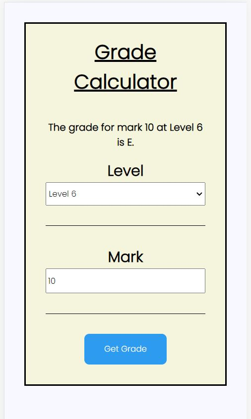

# Project - Grade Calculator

**Please note that boiler plate was provided by Developers Institute**

---

## Scenario for the Project

You are working for a new startup, Grade Calculator. Its grading system allows tertiary education institutions to calculate the grades of Level 5 and Level 6 students.

The previous Software Engineer started building the application but was urgently re-assigned to a different part of the business. You need to complete the remaining user stories for the web application, following the documentation below.

Your Tech Lead can support you if you need help understanding the requirements or are blocked with something in particular.

---

## Getting Started

**To build and run the app:**

```zsh
docker-compose up --build
```

**To run the client-side unit tests:**

```zsh
cd client
npm install
npm test
```

---

## Learning Outcomes

- Install and configure a web-based solution using web scripting.
- Use software development standards to implement a user interface.
- Write scripts/code that adheres to coding standards to implement and customise a secure solution using frameworks and libraries.
- Implement responsive design (with device and platform independence) using basic principles of user interface design (UI), with considerations for user experience (Ux), HCI principles, and universal accessibility.
- Apply the basic principles of interaction design and human computer interaction employing current and emerging technologies.
- Create and use a test plan that includes an overview of prototyping, utilises mock tools and tests with actual users and associated tools.
- Produce intuitive user training material and experiences that are accurate and implemented by both end users and technical staff.
- Install and configure systems software.
- Demonstrate advanced technical knowledge of applications for supporting user requirements.

---

## Screenshots of Final Project

### Grade Calculator


---

### Responsive Design (Mobile View)



---

## Dev Dependencies

- [ESLint](https://eslint.org/)
- [Jest](https://jestjs.io/)
- [Lodash](https://lodash.com/)
- [Prettier](https://prettier.io/)
- [SuperTest](https://www.npmjs.com/package/supertest)
- [ReactJs](https://reactjs.org/)
- [PostgresSQL](https://www.postgresql.org/)
- [Cors](https://www.npmjs.com/package/cors)
- [Express](https://expressjs.com/)
- [Joi](https://joi.dev/)
- [Nodemon](https://nodemon.io/)
- [SwaggerUI](https://swagger.io/tools/swaggerhub/?&utm_source=aw&utm_medium=ppcg&utm_campaign=SEM_SwaggerHub_PR_APAC_ENG_EXT_Prospecting&utm_term=swagger%20ui&utm_content=511271118125&gclid=CjwKCAiAhKycBhAQEiwAgf19egfNmOUPV82i47Ll_19EpUIrUcm1jyWh_TtlzRk5C17xCHW1pONJShoCX9IQAvD_BwE&gclsrc=aw.ds)
